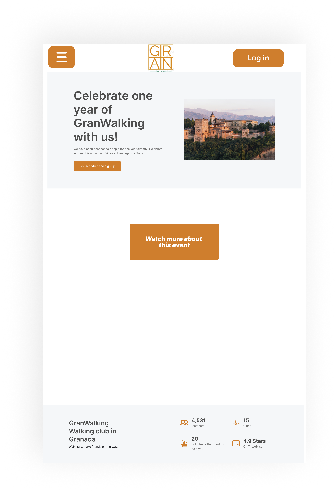

# DIU24
Prácticas Diseño Interfaces de Usuario 2023-24 (Tema: .... ) 

Grupo: DIU3_01_Borachos.  Curso: 2023/24 
Updated: 03/07/2024

Proyecto: 
GranWalking - walking, talking, making friends

Descripción: 

GranWalking is an application designed for all people in Granada that want to form new connections.
We offer free walking groups that anybody can join- no matter what their level of fitness might be. We are trying to suit as many needs as possible to make connecting to people in a new city as easy as possible.

Logotipo: 

Miembros
 * :bust_in_silhouette:   Charlotte Sophie AMMER   :octocat:     
 * :bust_in_silhouette:  Juan Manuel GUERRERO ESPIGARES     :octocat:

----- 

>>> Este documento es el esqueleto del report final de la práctica. Aparte de subir cada entrega a PRADO, se debe actualizar y dar formato de informe final a este documento online. Elimine este texto desde la práctica 1

# Proceso de Diseño 

## Paso 1. UX User & Desk Research & Analisis 

 **1.a User Reseach Plan**
-----

>>> Describe el plan de User Research (cómo se planteas)  

 1.b Competitive Analysis
-----

>>> Describe brevemente características de las aplicaciones que tienes asignadas, y por qué has elegido una de ellas 

 1.c Persona
-----

>>> Comenta brevemente porqué has seleccionado a esas personas y sube una captura de pantalla de su ficha  

 1.d User Journey Map
----

>>> Comenta brevemente porqué has escogido estas dos experiencias de usuario (y si consideras que son habituales) 

 1.e Usability Review
----
>>>  Revisión de usabilidad: (toma los siguientes documentos de referncia y verifica puntos de verificación de  usabilidad
>>>> SE deben incluir claramente los siguientes elementos
>>> - Enlace al documento:  (sube a github el xls/pdf) 
>>> - Valoración final (numérica): 
>>> - Comentario sobre la valoración:  (60-120 caracteres)

## Paso 2. UX Design  

 2.a Reframing / IDEACION: Feedback Capture Grid / EMpathy map 
----

When you arrive in a new country or city, it can be hard to feel at home. It hardly matters if you come for a limited amount of time or without a specific end date, and it also is possible to go to a new place for studies, work, personal or other reasons. No matter the reason, many people find it hard to connect and find friends in a new place.
One possible way to make connections is sports. However, joining a sports club often has proficiency or financial requirements. 
Therefore, we want to offer a Walking City Club for the city of Granada, which is open for any new person wanting to connect with others in the city. It is supposed to be a free weekly event that is open for anyone to join.
In this empathy map, we have evaluated the thoughts, questions, sayings and feelings a person might have when turning to our app. 

 Interesante | Críticas     
| ------------- | -------
  Preguntas | Nuevas ideas
  
    
>>> ¿Que planteas como "propuesta de valor" para un nuevo diseño de aplicación para economia colaborativa ?
>>> Problema e hipótesis
>>>  Que planteas como "propuesta de valor" para un nuevo diseño de aplicación para economia colaborativa te
>>> (150-200 caracteres)

 2.b ScopeCanvas
----
>>> Propuesta de valor 

 2.b User Flow (task) analysis 
-----

>>> Definir "User Map" y "Task Flow" ... 

 2.c IA: Sitemap + Labelling 
----

>>> Identificar términos para diálogo con usuario  

Término | Significado     
| ------------- | -------
  Login¿?  | acceder a plataforma

 2.d Wireframes
-----

>>> Plantear el  diseño del layout para Web/movil (organización y simulación ) 

## Paso 3. Mi UX-Case Study (diseño)

 3.a Moodboard
-----

>>> Plantear Diseño visual con una guía de estilos visual (moodboard) 
>>> Incluir Logotipo
>>> Si diseña un logotipo, explique la herramienta utilizada y la resolución empleada. ¿Puede usar esta imagen como cabecera de Twitter, por ejemplo, o necesita otra?

  3.b Landing Page
----
We have planned a landing page that shows an anniversary Granada walk to the Alhambra. The main event is shown centrally on the screen. More information is availiable if wanted.

>>> Plantear Landing Page 

 3.c Guidelines
----

In our guidelines for the design elements, we are focusing on the main element a website or
web application for GranWalking should contain. As an onboarding website, we will have the
closest up-coming event, meaning the event in the list of walks that will take place the
soonest. This will be agile and changing with the time.
The menu bar will be simple, since we do not offer any products and don’t need a shopping
cart. The navigation will include Home, Events, my Events, and my Account.
In the Home section, there will be the possibility to search for a specific event.
Events shows all upcoming events, and the user can sign up for events by clicking on a
specific event and then clicking the sign-up button. A calendar view is possible.
My Events shows all upcoming events that the user has signed up for. In this menu item, it is
possible to cancel participation for certain events.
Under my Account, the account can be managed, as well as settings evaluated and the FAQ
can be consulted.
Wizards will be kept to a minimum: the user can sign up or cancel an event they have
previously signed up for. Both options only are available when the user is signed in
(precondition).
For signing up for an event, the user clicks on the event, clicks on the corresponding button,
and confirms the sign-up. After a confirmation message, the user is brought back to the
home menu.
For cancelling an event, the user uses the menu bar option “my Events”, navigates to the
corresponding event, and presses the button “Cancel participation”. After successful
cancellation, the user will be brought back to the Home page.
We do not have cart items, since we do not provide a purchasable service. All our sign-up
events are free of charge. Our items are calendar items, for which the participant can sign up
by clicking a button specific for the event.
The About section and the FAQ can be found under the menu item “My Account” by
selection of the corresponding items in a whole-screen menu. This menu contains the items
My Data, Manage Account, Delete Account, Settings, and FAQ/About.
For tags, we have selected to use a tag that specifies if the walk allows dogs, and
additionally a tag that indicates the level of the walk. Finally, we have a tag indicating how
long the walk will be, such that everyone can select appropriate walking events.

  3.d Mockup
----

>>> Layout: Mockup / prototipo HTML  (que permita simular tareas con estilo de IU seleccionado)

 3.e ¿My UX-Case Study?
-----

>>> Publicar my Case Study en Github..
>>> Documente y resuma el diseño de su producto

## Paso 5. Exportación & evaluación con Eye Tracking 

Exportación a HTML/Flutter
-----

We have evaluated the COOK IT! app in order to understand the evaluation process a newly designed app has to go through.

)  5.b Eye Tracking method 

In order to evaluate the app, we have asked two potential users for their evaluation. We have chosen as participants one male and one female user, with different levels of experience in the field of application design. Both users liked the website and stated that they could see themselves use it regularly. They also stressed that the functionalities of the website were well integrated. The only critical point they have assessed was that not every user would find the website very easy to use and will understand quickly how it works. However, the users still gave 3 out of 5 points for this category, meaning that even though there is room for improvement, they still saw the foundation for success in this regard.

We have also conducted two different tasks for the users to assess using GazeRecorder. In both cases, we have asked the users a minimal task, and recorded their gaze as they observed the app.

GAZE TASK 1:
Image shown: Shopping cart containing two items.
Question asked: Please identify what you can do in this view of the app.

GAZE TASK 2:
Image shown: Specific course view.
Question asked: How clear is the purpose of this event?

Due to hardware constraints, we were only able to perform the viewing tasks once. We will evaluate the heatmaps of our test subject.

GAZE TASK 1 RESULT:

GAZE TASK 2 RESULT:

In the heatmaps shown above, it is visible that the subject has quickly identified the most relevant parts of the app. In the first heatmap, the image on top of the site draws attention, together with the bold headline. The text is shortly examined and the focus shifts to the Chef as well, that will be present on the event. The app is constructed in a way that allows the user to quickly identify the purpose of the activity.

In the second heatmap, the shopping cart is displayed. Attention is specifically drawn to the items in the cart, as well as the presented button on the bottom of the page used to complete the shopping process. A third area of interest is the icons on the top of the display, which indicates that the color and icon choice is complementary with the shopping cart design.

Diseño del experimento 
----

>> Uso de imágenes (preferentemente) -> hay que esablecer una duración de visualización y  
>> fijar las áreas de interes (AoI) antes del diseño. Planificar qué tarea debe hacer el usuario (buscar, comprar...) 

  
>> cambiar img por tu diseño de experimento  

>> Recordar que gazerecorder es una versión de pruebas: usar sólo con 3 usuarios para generar mapa de calor (recordar que crédito > 0 para que funcione) 

Resultados y valoración 
-----

We have realised through analysing the competing app and through the data obtained in the SUS, that our app has some improvement potential. The main issue of our app is the usability. The logos and workflow should be created clearer, so that users are encouraged to visit the app more often and to like the design. 
Additionally, we would like to implement an Event calendar, since it makes sense for the purpose of our app. We really enjoyed the design of the COOK IT! app calendar.

  

## Paso 4. Evaluación 

 4.a Caso asignado
----

>>> Breve descripción del caso asignado con enlace a  su repositorio Github

 4.b User Testing
----

>>> Seleccione 4 personas ficticias. Exprese las ideas de posibles situaciones conflictivas de esa persona en las propuestas evaluadas. Asigne dos a Caso A y 2 al caso B
 

User #USER3: A 31-year-old male entrepreneur with experience in web design and analysis. He manages his own businesses and assets, with a keen interest in evaluating quality work and exploring gastronomy in various locations. His technical background and entrepreneurial experience provide valuable insights into the usability and design of web interfaces.

User #USER4: A 29-year-old female hairdresser with experience in creating web pages using automated applications. She is a specialist in gastronomy, focusing on food tasting and critique. Her background combines creative and technical skills, offering a unique perspective on the usability of web designs, particularly in the context of gastronomy and food-related content.

| USUARIO ID | SEXO  | EDAD | OCUPACIÓN  | EXPERIENCIA TIC | PERFIL |
|------------|-------|------|------------|-----------------|--------|
| #USER3     | Hombre| 31   | Empresario | Experiencia en diseño y análisis de webs | Gestiono mis propios negocios y activos, me gusta valorar los buenos trabajos y la gastronomía en diferentes lugares |
| #USER4     | Mujer | 29   | Peluquera  | Experiencia en creación de páginas web usando aplicaciones automatizadas | Especialista en gastronomía, prueba y cata de alimentos |

 4.c Cuestionario SUS
----

>>> Usaremos el **Cuestionario SUS** para valorar la satisfacción de cada usuario con el diseño (A/B) realizado. Para ello usamos la [hoja de cálculo](https://github.com/mgea/DIU19/blob/master/Cuestionario%20SUS%20DIU.xlsx) para calcular resultados sigiendo las pautas para usar la escala SUS e interpretar los resultados
http://usabilitygeek.com/how-to-use-the-system-usability-scale-sus-to-evaluate-the-usability-of-your-website/)
Para más información, consultar aquí sobre la [metodología SUS](https://cui.unige.ch/isi/icle-wiki/_media/ipm:test-suschapt.pdf)

>>> Adjuntar captura de imagen con los resultados + Valoración personal 

 4.d Usability Report
----
The full usability report we did for COOK IT! can be read [here.](https://github.com/Machaquilla/DIU/blob/master/P4/Usability-Report24.md)

The full usability report the B group did for GRANWalking can be read [here.](https://github.com/G3rarB0net/DIU/blob/master/P4/P4_UsabReport_DIU3Borachos_doneby_DIU3_AveFenix.md)

5.) Conclusion de EVALUACION (A/B testing + usability report + eye tracking) 
----

It appears there have been some issues for the other group when evaluating our work. However, apart from the software issues, they evaluated us positively. They stated that some functionalities need more work, which we agree on. 

In conclusion, we have seen that app development includes many steps and also oftentimes means redesigning parts of the app when it is not evaluated in the way we anticipated.

## Conclusión final / Valoración de las prácticas

We have learned a lot in the course of this practice series. By designing our own web app and adjusting it to increasing levels of difficulty, we have been able to incorporate design principles and also seen some issues that we did not anticipate.
For example, the design of a landing page is vital, but not straightforward if we do not sell a product. Additionally, coordinating users and their event sign-ups can be crowding for the website. Therefore, in future work we suggest redesigning the sign-up process to include an event calendar for easier overview. 

We really enjoyed the color selection, choosing a bright orange to signify the sports events we provide. We also liked to choose fitting buttons and logos to go along with our vision.

Overall, the course has taught us the foundation of web design and we have seen a final product evaluation that signifies a good user evaluation.

